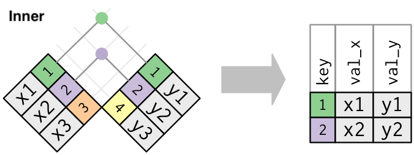

test wTF

```{r setup,echo =F, message = T, warning = F,eval=T,include=TRUE}
knitr::opts_chunk$set(echo = TRUE)
library(tidyverse)
# library(RColorBrewer)
library(ggpubr)
# library(egg)
## eval 代码要不要运行
## echo 代码要不要输出
## include 图要不要输出
## warning 警告要不要输出
## message 默认Bin等信息要不要输出
```

```{r,echo=FALSE,eval=FALSE}
#### XY axis theme ###
theme_classic()+
theme(panel.grid.major = element_blank(), panel.grid.minor = element_blank()
      ,panel.background = element_blank()
      ,axis.line = element_line(size=0.3, colour = "black")
      ,legend.position = 'none'
      ,text = element_text(size = 12))

#### frame axis theme ###
theme(
    panel.background = element_blank(),
    panel.border = element_rect(colour = "black", fill=NA, size=0.7)
    ,legend.position = 'none'
    ,text = element_text(size = 12))
# ggsave(p,filename = "~/Documents/test.pdf",height = 3,width = 4)

### 倾斜 45度  标签背景透明 ###
theme(axis.text.x = element_text(vjust = 1, hjust = 1, angle = 45))
theme(strip.background = element_blank())
theme(strip.background = element_rect(size = 0.4))
```


# Initiating datasets

```{r,echo=TRUE}
mpg
```

# Basic information in plot

## facets

display in small windows

* group by single element and display randomly

```{r}
ggplot(data = mpg) + 
  geom_point(mapping = aes(x = displ, y = hwy)) + 
  facet_wrap(~ class, nrow = 2)
```

* group by double elements 

```{r}
ggplot(data = mpg) + 
  geom_point(mapping = aes(x = displ, y = hwy)) + 
  facet_grid(drv ~ cyl)
```

* group by one element and display in rows or columns

```{r}
ggplot(data = mpg) + 
  geom_point(mapping = aes(x = displ, y = hwy)) +
  facet_grid(drv ~ .)

ggplot(data = mpg) + 
  geom_point(mapping = aes(x = displ, y = hwy)) +
  facet_grid(. ~ cyl)
```

## statistical transformation

line smooth 

```{r}
ggplot() + 
  geom_point(data = mpg, mapping = aes(x = displ, y = hwy)) + 
  geom_smooth(data = mpg, mapping = aes(x = displ, y = hwy))
```

geom_bar or stat_count

```{r}
demo <- tribble(
  ~cut,         ~freq,
  "Fair",       1610,
  "Good",       4906,
  "Very Good",  12082,
  "Premium",    13791,
  "Ideal",      21551
)

ggplot(data = demo) +
  geom_bar(mapping = aes(x = cut, y = freq), stat = "identity")

ggplot(data = diamonds) + 
  stat_count(mapping = aes(x = cut))
```

line-bar or stat_summary

```{r}
ggplot(data = diamonds) + 
  stat_summary(
    mapping = aes(x = cut, y = depth),
    fun.min = min,
    fun.max = max,
    fun = median
  )
```

## position adjustments

```{r}
ggplot(data = diamonds) + 
  geom_bar(mapping = aes(x = cut, fill = cut))

ggplot(data = diamonds) + 
  geom_bar(mapping = aes(x = cut, fill = clarity))
```

The stacking is performed automatically by the position adjustment specified by the position argument. If you don’t want a stacked bar chart, you can use one of three other options: "identity", "dodge" or "fill".

```{r}
ggplot(data = diamonds, mapping = aes(x = cut, fill = clarity)) + 
  geom_bar(alpha = 1/5, position = "identity")

ggplot(data = diamonds) + 
  geom_bar(mapping = aes(x = cut, fill = clarity), position = "fill")

ggplot(data = diamonds) + 
  geom_bar(mapping = aes(x = cut, fill = clarity), position = "dodge")

```

## Coordinate systems

90度翻转

```{r}
ggplot(data = mpg, mapping = aes(x = class, y = hwy)) + 
  geom_boxplot()
ggplot(data = mpg, mapping = aes(x = class, y = hwy)) + 
  geom_boxplot() +
  coord_flip()
```

地图适应

```{r}
nz <- map_data("nz")

ggplot(nz, aes(long, lat, group = group)) +
  geom_polygon(fill = "white", colour = "black")

ggplot(nz, aes(long, lat, group = group)) +
  geom_polygon(fill = "white", colour = "black") +
  coord_quickmap()
```

极坐标转换

```{r}
bar <- ggplot(data = diamonds) + 
  geom_bar(
    mapping = aes(x = cut, fill = cut), 
    show.legend = FALSE,
    width = 1
  ) + 
  theme(aspect.ratio = 1) +
  labs(x = NULL, y = NULL)

bar + coord_flip()
bar + coord_polar()
```


# Data transformations

## Filter

comparison: R provides the standard suite: >, >=, <, <=, != (not equal), and == (equal).

```{r,eval=TRUE}
library(nycflights13)
filter(flights, month == 1)
```

logical operations: you’ll need to use Boolean operators yourself: & is “and”, | is “or”, and ! is “not”.

```{r}
filter(flights, month == 11 | month == 12)
```

A useful short-hand for this problem is x %in% y. This will select every row where x is one of the values in y. We could use it to rewrite the code above:

```{r}
filter(flights, month %in% c(11, 12))
```

If you want to determine if a value is missing, use is.na():

```{r}
df <- tibble(x = c(1, NA, 3))
filter(df, is.na(x) | x > 1)
```

## Arrange

```{r}
arrange(flights, year, month, day)
```

Use desc() to re-order by a column in descending order,Missing values are always sorted at the end.

```{r}
arrange(flights, desc(dep_delay))
```

## Select

Select columns by name

```{r}
select(flights, year, month, day)
```

Select all columns between year and day (inclusive)

```{r}
select(flights, year:day)
```

Select all columns except those from year to day (inclusive)

```{r}
select(flights, -(year:day))
```

here are a number of helper functions you can use within select():
* starts_with("abc"): matches names that begin with “abc”.
* ends_with("xyz"): matches names that end with “xyz”.
* contains("ijk"): matches names that contain “ijk”.
* matches("(.)\\1"): selects variables that match a regular expression. This one matches any variables that contain repeated characters. * You’ll learn more about regular expressions in strings.
* num_range("x", 1:3): matches x1, x2 and x3.

```{r}
# rename columns 
rename(flights, tail_num = tailnum)
```

## Add

mutate() always adds new columns at the end of your dataset.

```{r}
flights_sml <- select(flights, 
  year:day, 
  ends_with("delay"), 
  distance, 
  air_time
)
mutate(flights_sml,
  gain = dep_delay - arr_delay,
  speed = distance / air_time * 60
)
```


If you only want to keep the new variables, use transmute():

```{r}
transmute(flights,
  gain = dep_delay - arr_delay,
  hours = air_time / 60,
  gain_per_hour = gain / hours
)
```

* useful operations

* \+,   \-,   \*,   \/,   \^
* "%/%" (integer division) and "%%" (remainder)

## Group summarise

```{r}
summarise(flights, delay = mean(dep_delay, na.rm = TRUE))

delays <- flights %>% 
  group_by(dest) %>% 
  summarise(
    count = n(),
    dist = mean(distance, na.rm = TRUE),
    delay = mean(arr_delay, na.rm = TRUE)
  ) %>% 
  filter(count > 20, dest != "HNL")

ggplot(data = delays, mapping = aes(x = delay)) + 
  geom_freqpoly(binwidth = 10)
```

# Scripts

## parse vector

```{r}
str(parse_logical(c("TRUE", "FALSE", "NA")))
#>  logi [1:3] TRUE FALSE NA
str(parse_integer(c("1", "2", "3")))
#>  int [1:3] 1 2 3
str(parse_date(c("2010-01-01", "1979-10-14")))
#>  Date[1:2], format: "2010-01-01" "1979-10-14"
guess_parser("2010-10-01")
#> [1] "date"
guess_parser("15:01")
#> [1] "time"
guess_parser(c("TRUE", "FALSE"))
#> [1] "logical"
guess_parser(c("1", "5", "9"))
#> [1] "double"
guess_parser(c("12,352,561"))
#> [1] "number"

str(parse_guess("2010-10-10"))
#>  Date[1:1], format: "2010-10-10"
```


## pivot

* longer

pivot the offending columns into a new pair of variables

```{r}
table4a
table4a %>% 
  pivot_longer(c(`1999`, `2000`), names_to = "year", values_to = "cases")
```

* wider 

You use it when an observation is scattered across multiple rows

```{r}
table2
table2 %>%
    pivot_wider(names_from = type, values_from = count)
```

* separate

separate() pulls apart one column into multiple columns, by splitting wherever a separator character appears

```{r}
table3
table3 %>% 
  separate(rate, into = c("cases", "population"))
```

* unite

unite() is the inverse of separate(): it combines multiple columns into a single column

```{r}
table5
table5 %>% 
  unite(new, century, year)
```

* join




```{r}
x <- tribble(
  ~key, ~val_x,
     1, "x1",
     2, "x2",
     3, "x3"
)
y <- tribble(
  ~key, ~val_y,
     1, "y1",
     2, "y2",
     4, "y3"
)

x %>% 
  left_join(y, by = "key")

x %>% 
  right_join(y, by = "key")

x %>% 
  full_join(y, by = "key")
```

* duplicate keys

One table has duplicate keys. This is useful when you want to add in additional information as there is typically a one-to-many relationship.


```{r}
x <- tribble(
  ~key, ~val_x,
     1, "x1",
     2, "x2",
     2, "x3",
     1, "x4"
)
y <- tribble(
  ~key, ~val_y,
     1, "y1",
     2, "y2"
)
left_join(x, y, by = "key")

```


Both tables have duplicate keys. This is usually an error because in neither table do the keys uniquely identify an observation. When you join duplicated keys, you get all possible combinations, the Cartesian product:

```{r}
x <- tribble(
  ~key, ~val_x,
     1, "x1",
     2, "x2",
     2, "x3",
     3, "x4"
)
y <- tribble(
  ~key, ~val_y,
     1, "y1",
     2, "y2",
     2, "y3",
     3, "y4"
)
left_join(x, y, by = "key")

```

* semi and anti


```{r}
top_dest <- flights %>%
  count(dest, sort = TRUE) %>%
  head(10)
flights %>% 
  semi_join(top_dest)
```


```{r}
flights %>%
  anti_join(planes, by = "tailnum") %>%
  count(tailnum, sort = TRUE)
```

## Strings

special character

```{r}
x <- "\u00b5"
```

combination

```{r}
str_c("x","y")
```

subset

```{r}
str_sub("i am a pretty girl", 3,12)
```

You can pick which set of rules to use by specifying a locale:

```{r}
str_to_upper(c("i", "ı"),locale = "tr")


x <- c("apple", "eggplant", "banana")

str_sort(x, locale = "en")  # English

str_sort(x, locale = "haw") # Hawaiian

```

> regular expressions

match

```{r}
x <- c("apple", "banana", "pear")
str_view(x, "an")
str_view(x, ".a.")
str_view(c("abc", "a.c", "bef"), "a\\.c")
```

anchor

```{r}
x <- c("apple", "banana", "pear")
## from start
str_view(x, "^a")
## to end
str_view(x, "a$")
```

Character classes and alternatives

* \d: matches any digit.
* \s: matches any whitespace (e.g. space, tab, newline).
* [abc]: matches a, b, or c.
* [^abc]: matches anything except a, b, or c.

```{r}
str_view(c("grey", "gray"), "gr(e|a)y")
```

Repetition

* \?: 0 or 1
* \+: 1 or more
* \*: 0 or more
* {n}: exactly n
* {n,}: n or more
* {,m}: at most m
* {n,m}: between n and m

> tools

detection

```{r}
x <- c("apple", "banana", "pear")
str_detect(x, "e")
```

extract

```{r}
colours <- c("red", "orange", "yellow", "green", "blue", "purple")
colour_match <- str_c(colours, collapse = "|")
colour_match
has_colour <- str_subset(sentences, colour_match)
matches <- str_extract(has_colour, colour_match)
head(matches)
```


replace

```{r}
x <- c("apple", "pear", "banana")
str_replace(x, "[aeiou]", "-")
```

splitting

```{r}
sentences %>%
  head(5) %>% 
  str_split(" ")
```

## Factors

ordering

```{r}
relig_summary <- gss_cat %>%
  group_by(relig) %>%
  summarise(
    age = mean(age, na.rm = TRUE),
    tvhours = mean(tvhours, na.rm = TRUE),
    n = n()
  )
#> `summarise()` ungrouping output (override with `.groups` argument)

ggplot(relig_summary, aes(tvhours, relig)) + geom_point()

ggplot(relig_summary, aes(tvhours, fct_reorder(relig, tvhours))) +
  geom_point()
```


